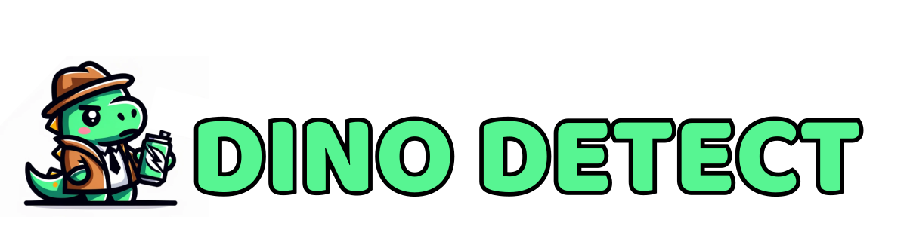

<div align="center">

<!-- Replace with your own banner/logo path -->


*Analyze Discord message history to understand trends and classify conversations with AI.*

<!-- Badges (edit links as needed) -->
[](https://devpost.com/software/dinodetect)


<a href="https://devpost.com/software/dinodetect">
  
</a>

</div>

### 📹 Watch the Demo

We built DinoDetect to analyze Discord conversations, especially for student org servers, by scraping message history and using AI to classify and summarize trends.

<div align="center">
  <a href="https://www.youtube.com/watch?v=Q9cEjgjdCxQ&t=1s" target="_blank">
    
  </a>

  <br><br>

  <a href="https://www.youtube.com/watch?v=Q9cEjgjdCxQ&t=1s" target="_blank">
    
  </a>
</div>


### 🦖 Overview

**DinoDetect** is a tool for **scraping and processing Discord messages** to uncover trends and **classify message history** in a meaningful way.  
It combines **JavaScript/Node.js**, **Discord’s API** for message retrieval, and **OpenAI’s API** for analysis and categorization.

## Quick Start

### (1) 🧰 Install Dependencies

Make sure you have:

- **Node.js** (LTS recommended)
- A Discord Bot token / API access
- An OpenAI API key

Install packages:

```bash
npm install
```

### (2) 🔑 Configure Environment Variables

Create a `.env` file in the project root (or set these in your shell):

```bash
touch .env
```

Add your keys (names may vary—adjust to your code):

```env
DISCORD_BOT_TOKEN="your_discord_token"
OPENAI_API_KEY="your_openai_key"
# Optional:
# GUILD_ID="..."
# CHANNEL_ID="..."
```

### (3) ▶️ Run

Start the app using whatever script your repo defines in `package.json`:

```bash
npm run start
```

If your project doesn’t define a start script yet, run the main entry file directly (adjust path/name):

```bash
node index.js
```


## 🧩 Tech Stack

| Component          | Technology |
| ------------------ | ---------- |
| 🧠 Core Logic      | JavaScript |
| 🧰 Runtime         | Node.js    |
| 💬 Data Source     | Discord API |
| 🤖 AI Analysis     | OpenAI API |
| 🔁 Communication   | fetch (request–response) |


## 🏆 Accomplishments

- Building an end-to-end pipeline from scraping → processing → analysis
- Seeing trends emerge from real message data
- Applying “signals” thinking in a new domain (chat analytics)
- Making a fun demo video

## 🛣️ What’s next

- Add a proper database layer (initial work started, time constrained)
- Expand AI analysis beyond trends (e.g., **toxicity** and other safety signals)
- Embed analysis visuals back into Discord (bots/embeds), and improve UX

## 👥 Authors

- Raul Valle — [GitHub](https://github.com/Jibby2k1)  
- Sebastian Sosa — [GitHub](https://github.com/CakeCrusher)  
- Matheus Kunzler Maldaner — [GitHub](https://github.com/matheusmaldaner)
